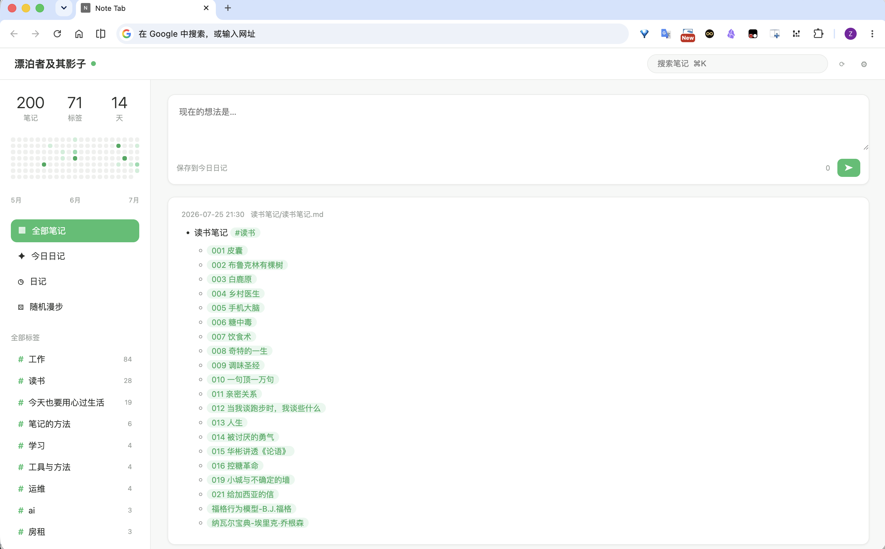

# Note API

Expose your vault through a localhost HTTP API (API-key protected) — view, create, edit and delete notes, resolve wiki links and serve binary assets from external tools.

Pairs with [Note Tab](https://github.com/fengshuzi/note-tab), an Infinity-style Chrome new tab for your journals:



## Features

- **Localhost only** — the HTTP server binds to `127.0.0.1`, never to the LAN.
- **API-key required** — every request needs `Authorization: Bearer <key>`; the key is auto-generated on first run and can be copied or regenerated in settings.
- **Full note CRUD** over the Vault API (markdown files only).
- **Wiki-link resolution** — uses Obsidian's own `metadataCache.getFirstLinkpathDest`, so shortest-path links like `[[001 皮囊]]` resolve exactly as they do in the app.
- **Binary asset serving** — images, PDFs, audio/video from the vault over HTTP.
- **Daily-notes config** — reads the vault's daily-notes folder/format so clients can find journals.
- Desktop only.

## API

Base URL: `http://127.0.0.1:27124` (port configurable).

All endpoints require `Authorization: Bearer <api-key>`. For `GET` requests the key may also be passed as `?key=` (needed by `` tags, which cannot send headers).

| Method | Path | Description |
|--------|------|-------------|
| GET | `/api/status` | Health check: vault name, plugin version. |
| GET | `/api/notes?q=&folder=&content=1&limit=` | List notes. `q` matches path **and** content; `content=1` includes note bodies; `limit` caps results (max 500). |
| GET | `/api/notes/<path>` | Read a note's content. |
| POST | `/api/notes` | Create a note. Body: `{"path": "folder/note.md", "content": "..."}`. Parent folders are created automatically. |
| PUT | `/api/notes/<path>` | Replace a note's content. Body: `{"content": "..."}`. |
| DELETE | `/api/notes/<path>` | Move a note to trash (respects the system/Obsidian trash setting). |
| GET | `/api/resolve?path=<linkpath>&source=<note>` | Resolve a wiki/markdown link to a real vault path (shortest-path aware). |
| GET | `/api/assets/<path>` | Serve a vault file as binary (images, PDF, audio, video). |
| POST | `/api/assets?filename=<name>&folder=assets` | Upload raw bytes (`Content-Type: application/octet-stream`) as a vault file. Defaults to `assets/`; auto-renames on conflict. |
| GET | `/api/daily-notes/config` | Daily-notes folder + filename format. |

### Examples

```bash
KEY="<paste from settings>"

curl -H "Authorization: Bearer $KEY" http://127.0.0.1:27124/api/status

curl -H "Authorization: Bearer $KEY" "http://127.0.0.1:27124/api/notes?q=%23读书&content=1&limit=50"

curl -H "Authorization: Bearer $KEY" http://127.0.0.1:27124/api/notes/journals/2026-07-25.md

curl -X POST -H "Authorization: Bearer $KEY" -H "Content-Type: application/json" \
  -d '{"path":"Inbox/hello.md","content":"# Hello"}' \
  http://127.0.0.1:27124/api/notes

curl -X PUT -H "Authorization: Bearer $KEY" -H "Content-Type: application/json" \
  -d '{"content":"# Updated"}' \
  http://127.0.0.1:27124/api/notes/Inbox/hello.md

curl -X DELETE -H "Authorization: Bearer $KEY" http://127.0.0.1:27124/api/notes/Inbox/hello.md

# Resolve a shortest-path link, then fetch the image
curl -H "Authorization: Bearer $KEY" \
  "http://127.0.0.1:27124/api/resolve?path=pasted-image.png&source=journals/2026-07-25.md"
open "http://127.0.0.1:27124/api/assets/assets/pasted-image.png?key=$KEY"
```

## Settings

- **Server status** — start/stop the HTTP server.
- **Port** — localhost port (default `27124`); apply & restart after changing.
- **API key** — required for every request. Fresh installs start with the shared default `addwxfengshu4511` (so clients like note-tab connect out of the box); regenerate here if you see that as a risk.
- **Start on launch** — auto-start the server when the vault opens.

## Installation

1. Download `main.js`, `manifest.json`, `styles.css` from the latest release.
2. Place them in `<vault>/.obsidian/plugins/note-api/`.
3. Enable **Note API** in Settings → Community plugins.
4. Copy the API key from the plugin settings and configure your client.

## Development

```bash
npm install
npm run dev      # watch build
npm run build    # strict lint + typecheck + production bundle to dist/
npm run deploy   # build + copy into local vaults
npm run release  # build + GitHub release via gh CLI
```

## License

MIT

---

# Note API（中文说明）

把 vault 通过本地 HTTP API 暴露给外部工具：查看、新建、编辑、删除笔记，解析 wiki 链接，并提供图片等二进制资源访问。默认只监听 `127.0.0.1`，所有请求必须携带 API key（`Authorization: Bearer <key>`，设置页可复制/重新生成）。

配套 Chrome 扩展 [Note Tab](https://github.com/fengshuzi/note-tab)：Infinity 风格新标签页，默认打开今日日记，支持 markdown 渲染、双击编辑、标签、热力图、wiki 链接和图片显示。

接口、示例与设置说明见上方英文部分。
